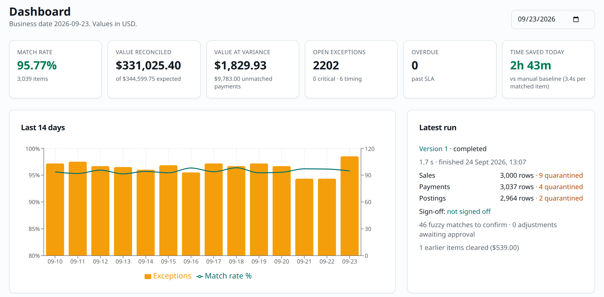

# ReconFlow

ReconFlow is the daily sales reconciliation automation for Tupande. Each morning, it pulls the sales, payments and ERP postings. It matches them with deterministic rules. Each difference becomes an exception with an owner and a due date. A different person must approve each correction before it goes to the ERP. Each correction has an idempotency key. The system records all actions in an audit trail with a hash chain. An optional AI assistant suggests causes and next steps. People make the decisions.

> **Synthetic data only.** This system is a demonstration. It contains no real customer data.



**Live demo:** http://212.56.45.149:8090 (the demo logins are below).

## Stack

Laravel 13 (PHP 8.3) with one module for each business function, PostgreSQL 16, and Inertia with React 19, TypeScript, Tailwind and shadcn/ui. FrankenPHP runs behind Caddy, in Docker Compose. The AI assistant uses the official Anthropic PHP SDK (Claude). [Technology choices](docs/technology-choices.md) gives the reasons.

## Run it with Docker (no configuration)

You need only **Docker**: Docker Desktop on macOS or Windows, or Docker Engine with the Compose plugin on Linux. You do not need PHP, Node, a database or an `.env` file.

1. Get the code and start the system:

   ```bash
   git clone https://github.com/Okonu/reconflow.git
   cd reconflow
   docker compose up -d --build
   ```

2. Open **http://localhost:8080**.
3. Sign in with an account from the table below. The password is **`ReconFlow2026`**.

On the first start, these steps occur:

1. Docker builds the image. The first build takes 3 to 6 minutes. Later builds use the cache.
2. PostgreSQL starts. The application makes its secrets (application key, pseudonym salt, source-system token) in a Docker volume. It runs the migrations and makes the roles and demo users.
3. When `docker compose ps` shows `app` as **healthy**, you can use the pages. A background worker then makes 14 days of synthetic data (3,000 sales each day) and reconciles each day. The dashboard shows "Preparing demo data…" and refreshes automatically. This takes some minutes.

Useful commands:

| Command | Result |
|---|---|
| `docker compose ps` | Shows the status of the services. `app` must be healthy |
| `docker compose logs -f app worker` | Shows the logs |
| `docker compose down` | Stops the system. The data stays in the Docker volumes |
| `docker compose down -v` | Stops the system and deletes all data. The next `up` starts with new data |

Docker Compose also reads a `.env` file in the project root, if one exists (for example, from local development). If you have one, use `make up`. `make up` does not read it.

**Optional settings:** copy `deploy/.env.example` to `deploy/.env` and change the values. Then run `docker compose --env-file deploy/.env up -d` (or `make up`). The usual changes are:

| Setting | Default | When to change it |
|---|---|---|
| `HTTP_PORT` | `8080` | Another program uses port 8080 on your computer |
| `APP_URL` | `http://localhost:8080` | You use a different host or port (notification links use this value) |
| `ANTHROPIC_API_KEY` | empty | You want Claude for the AI suggestions. Without a key, the AI panels use a labelled offline rules stub. All pages still operate |
| `DEMO_PASSWORD` | `ReconFlow2026` | For each shared or public deployment |
| `SITE_ADDRESS`, `SESSION_SECURE_COOKIE` | `:80`, `false` | For a real domain with HTTPS, set `SITE_ADDRESS=your.domain` and `SESSION_SECURE_COOKIE=true`. Caddy gets the certificate |

The system runs five containers:

- `app`: the web process.
- `worker`: the queue (reconciliation, postings, AI, notifications).
- `scheduler`: the 06:00 run, summaries and retention.
- `db`: PostgreSQL 16, on the internal network only.
- `caddy`: the reverse proxy on port 8080.
 [Deployment](docs/deployment.md) gives the procedures for servers, HTTPS, backups and upgrades.

## Local development (without Docker)

You need PHP 8.3, Composer, Node 22 and PostgreSQL 16.

```bash
cp .env.example .env && php artisan key:generate   # then set the DB_* values
make install
make migrate seed
make dev                                 # php artisan serve + queue worker + vite
```

## Demo logins

Password: `ReconFlow2026` (the value of `DEMO_PASSWORD`).

| Login | Role | Permissions |
|---|---|---|
| `analyst@demo` | Recon Analyst | Run reconciliations, upload data, work on exceptions, propose adjustments, use the AI |
| `manager@demo` | Finance Manager | All analyst permissions. Also approve (including more than $1,000), sign off and reopen dates, and export unmasked data |
| `auditor@demo` | Auditor | Read only. Personal data is masked. Check and export the audit log |
| `admin@demo` | Administrator | Users, roles, settings, the AI kill switch and the demo reset |

Roles are made of permissions. An administrator can change the permissions of a role, or make new roles, on the Roles page.

## Five-minute demo

1. Sign in as **analyst@demo**. The dashboard shows 14 days of history. It shows a match rate of approximately 96%, the value at variance, the open exceptions and the time saved today.
2. Select **Runs → Run now** for the latest closed date. The run completes in seconds. Open the run to see the data-quality report and the rows in quarantine.
3. Open **Report**. Filter to *Variance*. Select **Export XLSX**. The phone numbers are masked.
4. Open **Exceptions** and select an under-payment. The page shows the sale, the payment, the posting, the rule and the AI suggestion. Accept the suggestion and propose a write-off.
5. Open **Approvals**. The approve button is disabled with the text "someone else must approve (segregation of duties)".
6. Sign in as **manager@demo**. Approve the adjustment. The ERP gets the journal `ADJ-…` with its idempotency key.
7. After the next run, a **timing** exception from the previous day shows *Resolved… by payment…*.
8. Sign in as **auditor@demo**. The phone numbers are masked. Open **Audit log**, filter the entity type `adjustment` and select **Verify integrity**. The check passes.
9. Open **Data uploads**. Download the payments template. Upload `samples/golden/payments_2026-09-22.xlsx`. The preview shows 2 invalid rows with the reasons. Confirm the upload and run 2026-09-22. The counts agree with the answer key.
10. Sign in as **admin@demo** and open **AI oversight**. The page shows the acceptance and override rates. Turn on the kill switch. The rules still categorise the exceptions.
11. Sign in as **manager@demo** and open **Sign-off**. Clear the blockers, give a comment for the carried exceptions and sign off. The date is locked.

## Quality

```bash
make test      # Pest (unit, feature, architecture) and the TypeScript check (needs the local setup)
make lint      # Pint, Larastan and ESLint
php artisan reconflow:ai-eval --stub       # AI evaluation baseline (without --stub when a key is set)
```

The engine reproduces the golden answer key (65 items) and the volume answer key (2,531 items) in `samples/` exactly. A performance test reconciles 50,000 sales in less than 10 seconds. 376 tests pass. Refer to the [Test report](docs/test-report.md).

## Documentation

The documents are in ASD-STE100 Simplified Technical English. [docs/README.md](docs/README.md) gives the full list and a glossary.

| Document | Contents |
|---|---|
| [Process map](docs/process-map.md) | The manual process today and the automated process |
| [Business case](docs/business-case.md) | Value, costs, rollout plan and measures of success |
| [Decision log](docs/decision-log.md) | Decisions, options, reasons and the use of AI tools |
| [Technology choices](docs/technology-choices.md) | The reason for each technology |
| [Architecture](docs/architecture.md) | Application structure, layers, coding principles, components and data flow |
| [Reconciliation rules](docs/reconciliation-rules.md) | Each rule in plain language, with examples |
| [Assumptions](docs/assumptions.md) | Business assumptions and scope limits |
| [Data model](docs/data-model.md) | The entity diagram and the tables |
| [Controls matrix](docs/controls-matrix.md) | Risk, control, enforcement and evidence |
| [Risk register](docs/risk-register.md) | Delivery and operation risks |
| [AI governance](docs/ai-governance.md) | Use register, model card, risk assessment, oversight and go-live gates |
| [Data protection](docs/data-protection.md) | Inventory, data that goes out, masking, retention and DPIA |
| [Runbook](docs/runbook.md) | Daily operation and incident procedures |
| [Deployment](docs/deployment.md) | Requirements, settings, HTTPS, backups, upgrade and rollback |
| [Routes and APIs](docs/api.md) | Routes, JSON endpoints, and the mock source and ERP APIs |
| [Build notes](BUILD_NOTES.md) | The engineering log from the build (not in STE) |

## Out of scope (steps for production)

- Real source integrations.
- SSO (for example Azure AD).
- Multiple currencies and multiple legal entities.
- High availability.
- The formal approval of the retention policy.
- A penetration test.
