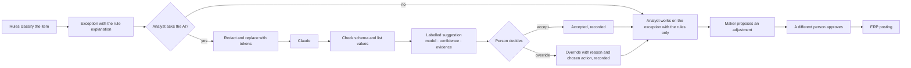

# AI governance

ReconFlow uses a large language model (Anthropic Claude) as an **assistant**. The assistant helps with the triage of exceptions and writes a daily summary. It never does an action. This document contains the AI use register entry, the model card, the risk assessment and the oversight design.

## 1. AI use register entry

| Field | Entry |
|---|---|
| Use case | Triage of reconciliation exceptions with AI help, and a daily summary in plain language |
| Purpose | Make the investigation faster. The AI proposes a likely cause and a next step, with evidence. Managers get a short daily summary |
| Business owner | Finance Manager. Record the name of the AI owner and the date of the last AI review in Settings → AI assistant |
| System owner | ReconFlow administrator |
| Users | Recon Analysts and Finance Managers (`ai.use`). Finance Managers, Auditors and Administrators do the oversight (`ai.oversee`) |
| Model and provider | Anthropic Claude through the API. The default model is `claude-opus-5` (a setting). Adaptive thinking, JSON-schema output, and a fallback on the server if the model declines |
| Data that it uses | Triage: the status, rule, amounts, times, channel, region, product, references and ERP lines of one exception. Salted pseudonym tokens replace customers, payers and agents. Summary: counts and totals only |
| Data that it does not use | Phone numbers, names, email addresses, user identities and comments |
| Type of decision | Advice only. AI output cannot cause a state change, an adjustment, a posting or a sign-off |
| Risk level | **Medium.** The context is a financial process, but a person examines each output. After redaction, there is little personal data |
| Controls | Redaction. A person accepts or overrides each suggestion, and an override needs a reason. Kill switch. A log of each call. Oversight figures. An evaluation set. Prompts with versions. Rate limits |
| Review | An AI review each quarter (record the date in Settings). Also a review at each change of prompt or model |
| Go-live status | **Not approved for production.** The gates in section 7 must be complete first |

## 2. Model card

**Intended use.** The deterministic rules classify each exception first. The AI then suggests the most likely business cause from a fixed list (`LikelyCause`) and the most useful next action from a fixed list (`RecommendedAction`). It gives a reason in two or three sentences, gives evidence from the records, and gives a confidence from 0 to 1.

**Input.** `Modules/AI/app/Services/Redactor.php` makes the input. The system keeps the exact redacted JSON with each suggestion.

**Output.** The server validates the JSON against `Modules/AI/app/Support/Schemas.php` and checks the list values. The system rejects output that is not valid and records a failure.

**Prompts.** `Modules/AI/resources/prompts/v1_triage.md` and `v1_run_summary.md`. The system keeps the prompt version and its SHA-256 hash with each call. A change to a prompt is a code change. It goes through review and CI.

**Limits and known failures.**
- The AI sees only the records that it gets. It does not know about events outside the system, for example a telephone call from a customer or a bank delay.
- It can trust references too much. A reference with a typing error that looks like a different sale can cause an incorrect suggestion.
- It can be incorrect with high confidence on unusual patterns, for example instalments across days. The confidence is an estimate of the model. It is not a calibrated probability.
- Pseudonym tokens do not show if two phone numbers belong to the same person.
- Amounts are text. The model can make arithmetic errors on items with many payments. The variance from the engine is the correct value.
- The provider can decline a request. A fallback model then answers, and the system sets the flag `served_by_fallback`.
- The provider can be unavailable, slow or at its rate limit. The page then shows "AI suggestion unavailable". All functions continue with the rules only.

**Evaluation.** `Modules/AI/resources/evals/triage_v1.json` contains 20 labelled cases. They cover each type of exception and some difficult cases. `php artisan reconflow:ai-eval` calculates the accuracy of the action and the cause, and keeps the result. The oversight page shows the result. The option `--stub` gives a rules-only baseline. CI runs the evaluation only when an `ANTHROPIC_API_KEY` secret exists.

## 3. Human oversight

- Each suggestion has the label **AI generated**, with the model name, prompt version, confidence and evidence. The rule explanation is adjacent. Thus the user can always compare the rules and the AI.
- To accept a suggestion only records agreement. The analyst still uses the usual workflow. A second person must still approve each correction.
- An override needs a reason of 5 or more characters. The user can also record the action that they selected.
- The AI module can write only to `ai_suggestions`. It has no code path to exceptions, adjustments, postings or sign-offs.

## 4. Risk assessment

| Risk | Likelihood | Impact | Control | Evidence |
|---|---|---|---|---|
| An incorrect suggestion causes an incorrect correction | Medium | Medium | A person decides. Maker-checker for each adjustment. The rule explanation is adjacent | `ai_suggestions.status`. Adjustment approvals |
| Users accept suggestions without a check | Medium | Medium | Monitor the override rate for each category and the acceptance rate. Quarterly review. The AI must give evidence | The oversight page |
| Personal data goes to the provider | Low | High | Redaction before each call. The stored input shows exactly what the system sent | `ai_suggestions.input`. The redaction tests |
| Instructions hidden in record fields (for example in a payment reference) | Low | Low | The output schema accepts only list values. The AI cannot do actions. Fields go to the AI as JSON data | Schema validation |
| The provider is unavailable or slow | Medium | Low | The system continues without the AI. Time limits and retries. Kill switch | Audit events `ai.suggestion_failed`. The failure rate |
| The model or the prompt changes behaviour | Medium | Medium | Prompts have versions. Run the evaluation set at each change. The model is a setting | `ai_eval_runs`. `setting_versions` (ai) |
| Costs increase too much | Low | Low | Rate limits (20 triage calls and 10 summaries each minute for each user). A maximum of 200 items in a batch. The page shows token use | The tokens figure on the oversight page |
| The API key leaks | Low | High | The key is only in the environment or a secret store. The logs remove it (`sk-ant-…`). The browser never gets it | The log filter. The configuration |

## 5. Figures on the AI oversight page

- The number of triage calls, the acceptance rate, the overrides and the **override rate for each exception category**
- The average confidence and the rate of failures and time-outs
- The average response time and the input and output tokens
- The responses from the fallback model
- The latest overrides with reasons, the latest requests and the evaluation runs
- The state of the kill switch, who changed it and when. The AI owner and the date of the last review

## 6. Kill switch and operation without the AI

A user with `ai.manage` can turn the assistant off on the oversight page or in Settings. The change applies immediately to all users. The audit trail records it (`ai.kill_switch_toggled`). When the AI is off, or when there is no key, the rules still categorise the exceptions. The AI panels show why the assistant is not available. All workflows operate as usual.

## 7. Go-live gates

1. The **DPO approves** the commercial API terms of the provider (data use, retention, sub-processors) and the **transfer of the redacted data out of Kenya**. Record the approval in the DPIA.
2. The latest evaluation on the production model and prompt meets the agreed level. We propose: the recommended action is correct in 85% or more of the cases, with no schema errors.
3. Finance names the AI owner and records the date of the first AI review in Settings.
4. The API key comes from the secret store. The provider account has a budget alert.
5. The analysts know that suggestions are only advice and that an override needs a reason.
