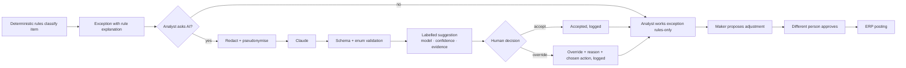

# AI governance

ReconFlow uses a large language model (Anthropic Claude) as an **assistant** for exception triage and daily narrative summaries. It never takes action. This document is the AI use register entry, model card, risk assessment and oversight design.

## 1. AI use register entry

| Field | Entry |
|---|---|
| Use case | AI-assisted triage of reconciliation exceptions, plus a plain-language daily summary |
| Purpose | Speed up analyst investigation by proposing a likely cause and next step with cited evidence; give managers a two-minute daily briefing |
| Business owner | Finance Manager (the accountable AI owner role is recorded under Settings → AI assistant, with the date of the last AI review) |
| System owner | ReconFlow administrator |
| Users | Recon Analysts and Finance Managers (`ai.use`); oversight by Finance Manager, Auditor and Administrator (`ai.oversee`) |
| Model / provider | Anthropic Claude via API; default `claude-opus-5` (configurable), adaptive thinking, JSON-schema structured output, server-side refusal fallback |
| Data used | Triage: one exception's status, rule, amounts, timestamps, channel, region, product, references and ERP lines, with customers, payers and agents replaced by salted pseudonym tokens. Summary: aggregate counts and totals only |
| Data not used | Phone numbers, names, emails, user identities, free-text comments |
| Decision type | Advisory only. No state change, adjustment, posting or sign-off can be triggered by AI output |
| Risk level | **Medium**: financial-process context with human review of every output; low personal-data exposure after redaction |
| Controls | Redaction, human accept/override with a required override reason, kill switch, per-call logging, oversight metrics, eval set, versioned prompts, rate limits |
| Review cadence | Quarterly AI review (record the date in Settings), plus a review whenever the prompt or model changes |
| Go-live status | **Not approved for production** until the gates in section 7 are met |

## 2. Model card

**Intended use.** Given a reconciliation exception that the deterministic rules have already classified, suggest the most likely business cause from a fixed list (`LikelyCause`) and the single most useful next action from a fixed list (`RecommendedAction`). Explain in two or three sentences, cite evidence from the records, and state a confidence from 0 to 1.

**Inputs.** Built by `Modules/AI/app/Services/Redactor.php`; the exact redacted JSON is stored with each suggestion.

**Outputs.** JSON validated against `Modules/AI/app/Support/Schemas.php`, with enum values checked server-side. Invalid output is rejected and recorded as a failure.

**Prompts.** `Modules/AI/resources/prompts/v1_triage.md` and `v1_run_summary.md`. The version and SHA-256 of the prompt are stored with every call. Changing a prompt is a code change that goes through review and CI.

**Limitations and known failure modes.**
- It can only see the records given to it. Context outside the system (a customer's phone call, a bank delay) is invisible.
- It may over-trust references. A mistyped reference that looks like another sale can mislead it.
- It can be confidently wrong on unusual patterns (for example split instalments across days). Confidence is the model's estimate, not a calibrated probability.
- Pseudonym tokens hide whether two different phone numbers belong to the same person.
- Amounts are strings; the model can misread arithmetic on many-payment items. The engine's variance figure is authoritative.
- The provider can decline a request (refusal); a fallback model then answers, which is flagged `served_by_fallback`.
- The provider can be down, slow or rate limited. The UI says "AI suggestion unavailable" and all functions continue rules-only.

**Evaluation.** `Modules/AI/resources/evals/triage_v1.json` holds 20 labelled cases covering every exception type and edge cases (tolerance-level shortfalls, cash without reference, critical unidentified receipts, near-midnight timing, duplicates on two channels, duplicate postings across days). `php artisan reconflow:ai-eval` scores recommended-action and likely-cause accuracy and stores the run (visible on the oversight page). `--stub` gives a rules-only baseline. CI runs the eval when an `ANTHROPIC_API_KEY` secret is configured and skips it otherwise.

## 3. Human-oversight design

- Suggestions are labelled **AI generated** with the model name, prompt version, confidence and evidence, next to the rule explanation, so users can always compare what the rules said with what the AI suggested.
- Accepting a suggestion only records agreement. The analyst still acts through the normal workflow, and corrections still need a second person to approve.
- Overrides require a reason (at least 5 characters) and can record the action the person chose instead.
- The AI module can write only to `ai_suggestions`. It has no code path to exceptions, adjustments, postings or sign-offs.

## 4. Risk assessment

| Risk | Likelihood | Impact | Control | Evidence |
|---|---|---|---|---|
| Wrong suggestion leads to a wrong correction | Medium | Medium | Human decision required; maker-checker on every adjustment; rule explanation shown alongside | `ai_suggestions.status`; adjustment approvals |
| Automation bias (rubber-stamping) | Medium | Medium | Override rate by category and acceptance rate monitored; quarterly review; evidence must be cited | Oversight page |
| Personal data disclosed to the provider | Low | High | Redaction and scrub before every call; stored input shows exactly what left | `ai_suggestions.input`; governance tests (redaction) |
| Prompt injection via record fields (for example a payment reference) | Low | Low | Output restricted to an enum-bound schema; AI cannot act; fields are passed as data in JSON | Schema validation |
| Provider outage or latency | Medium | Low | Graceful degradation; timeouts and retries; kill switch | `ai.suggestion_failed` events; failure rate |
| Model or prompt drift | Medium | Medium | Versioned prompts; eval set run on change; model pinned in settings | `ai_eval_runs`; `setting_versions` (ai) |
| Cost runaway | Low | Low | Rate limits (20 triage/min per user, 10 summaries/min), batch cap (200), token usage shown | Oversight tokens tile |
| API key leakage | Low | High | Key only in env/secrets; never logged (log processor scrubs `sk-ant-…`); not exposed to the browser | Log scrubber; config |

## 5. Monitoring metrics (AI oversight page)

- Triage volume, acceptance rate, overrides, and **override rate by exception category**
- Average confidence and failure/timeout rate
- Average latency and input/output tokens
- Responses served by the refusal fallback
- Recent overrides with reasons, recent requests, evaluation runs
- Kill switch state, who toggled it and when; accountable owner and last review date

## 6. Kill switch and degradation

Holders of `ai.manage` can switch the assistant off from the oversight page or Settings. The change is immediate for everyone and audited (`ai.kill_switch_toggled`). With the AI off, or no key configured, exceptions are still categorised by the rules, the AI panels explain why the assistant is unavailable, and every workflow works unchanged.

## 7. Go-live gates

1. **DPO approval** of the provider's commercial API terms (data use, retention, sub-processors) and of the **cross-border transfer** of the redacted data, recorded in the DPIA.
2. Latest eval run on the production model and prompt meets the agreed bar (proposed: recommended action correct in at least 85% of cases, no schema errors).
3. Accountable AI owner named and first AI review date recorded in Settings.
4. API key provisioned through the secrets manager, with a budget alert set with the provider.
5. Analysts briefed that suggestions are advisory and overrides need reasons.
