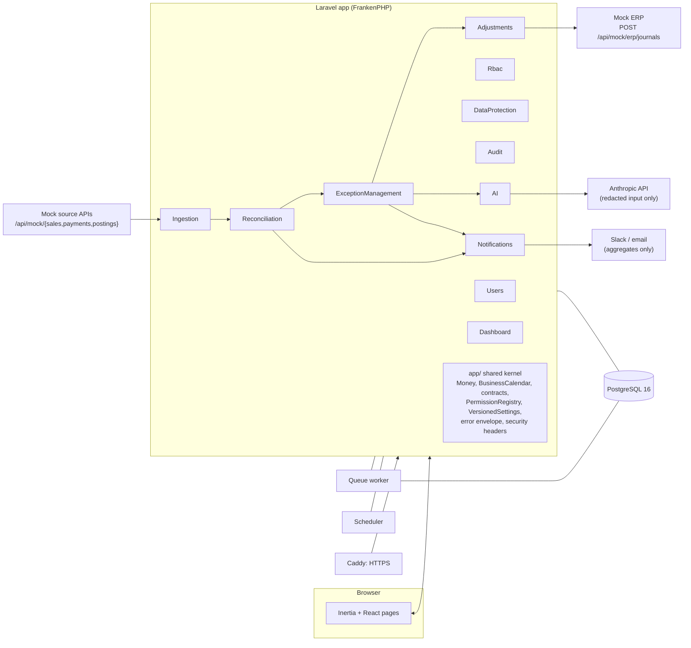

# Architecture

ReconFlow is a single Laravel 13 application made of function-specific modules (nwidart/laravel-modules). A small shared kernel lives in the root `app/`. It uses PostgreSQL 16 for all state and a queue worker plus scheduler for background work. The UI is Inertia + React, served from the same app, so there is no separate SPA or API gateway.

## Components



| Module | Owns |
|---|---|
| Users | accounts, login/logout, Argon2id hashing, login throttling, deactivation |
| Rbac | permission catalogue sync, roles composed of permissions, role assignment |
| Audit | append-only, hash-chained `audit_events`, verifier, gzipped JSONL archive with checkpoint |
| DataProtection | field inventory and classification, masking, pseudonymisation, PII-safe log processor, audited unmask |
| Ingestion | source connectors, mock source store, synthetic data generator, uploads (staging → preview → confirm), DQ validation and quarantine, immutable batch versions, mock ERP |
| Reconciliation | pure matching engine (R1–R7), run lifecycle and versioning, item state ledger, fuzzy review, manual matches, report and exports, rule settings |
| ExceptionManagement | exceptions keyed across re-runs, severity/SLA, assignment, state machine, comments/timeline, sign-off and date lock |
| Adjustments | correcting journals, maker-checker approvals, threshold, idempotent ERP posting and retry |
| AI | Claude client, redaction, versioned prompts, triage and run narratives, human accept/override, kill switch, oversight, eval set |
| Notifications | in-app bell, optional Slack/email, run alerts, critical-exception alerts, daily summary |
| Dashboard | KPIs, trends, category and ageing charts |

Modules talk to each other through events (`RunFinished`, `ExceptionsSynced`, `ItemStateChanged`, `FuzzyMatchRejected`, `DemoDataSeeded`) and through contracts in `app/Contracts`: `BusinessDateLock`, `ExceptionDetailContributor`, `SettingsSection`, `ResetsDemoData`, `PermissionEnum`, `AuditActor`. For example, the exception detail page is assembled from panels that Adjustments and AI contribute, without ExceptionManagement knowing about either.

## Daily data flow

```mermaid
sequenceDiagram
    autonumber
    participant S as Scheduler (06:00 EAT)
    participant I as Ingestion
    participant R as Reconciliation
    participant E as ExceptionManagement
    participant N as Notifications
    participant H as Analyst / Manager
    participant A as Adjustments
    participant ERP as Mock ERP

    S->>I: pull sales, payments, postings for D
    I->>I: validate (DQ), quarantine bad rows, store immutable batch version (only if checksum changed)
    S->>R: reconcile D (advisory lock per date)
    R->>R: load active batches + carried items, run engine R5 → manual → R1 → R2 → R3 → R4/R6 → R7
    R->>R: write run version, results, item states; supersede previous version
    R-->>E: RunFinished
    E->>E: open / relink / reclassify / close exceptions by stable key
    E-->>N: ExceptionsSynced (critical alerts)
    H->>E: review, comment, ask AI for a suggestion (optional)
    H->>A: propose adjustment (maker)
    H->>A: approve (checker ≠ maker, threshold)
    A->>ERP: POST journal with idempotency key
    ERP-->>A: journal id (or failure → POSTING_FAILED, retry)
    A-->>E: exception resolved
    H->>E: sign off D → date locked
```

## Key design decisions

- **Deterministic engine, integer cents.** The engine works on integer cents and Unix seconds with no I/O. Money is `brick/math` BigDecimal at the edges, and floats are rejected by `MoneyCast`. The same inputs always give the same outputs. Both answer keys (65 golden items and 2,531 volume items) reproduce exactly.
- **Separate ingestion from reconciliation.** Batches are immutable snapshots with one active version per source and date. A run records the exact batch versions it used, so any historical result can be explained.
- **Runs are versioned, never overwritten.** A re-run supersedes the previous version. Exceptions survive re-runs through a stable key (identity + status family), so comments, owners and adjustments stay attached.
- **Permissions first.** Code defines permissions (per-module enums). Roles are data composed of permissions, and every action is authorised by a policy that checks permissions, never role names.
- **Maker-checker in the policy layer.** Segregation of duties and the high-value threshold are enforced in `AdjustmentPolicy`, so the UI, API and jobs all go through the same rule.
- **Idempotent side effects.** Each adjustment carries one idempotency key for life. The ERP replays the original journal for a repeated key, and retries reuse the key.
- **Tamper-evident audit.** Each event stores `sha256(prev_hash + canonical JSON)`. A trigger blocks UPDATE and DELETE (except the checkpointed archiver), and `Verify integrity` recomputes the chain.
- **AI as an advisor only.** The AI module can write only to `ai_suggestions`. It sees pseudonymised records, stores the redacted input and its hash, and every suggestion needs a human accept or override (with a reason).
- **Versioned settings.** Rule, severity, approval and AI settings are versioned with the author and reason, and audited.
- **Operational visibility.** A request ID is attached to every log line and error envelope. `/health`, `/ready` and Prometheus `/metrics` report runs, exceptions and queue state. Logs are scrubbed of phone numbers and secrets.
