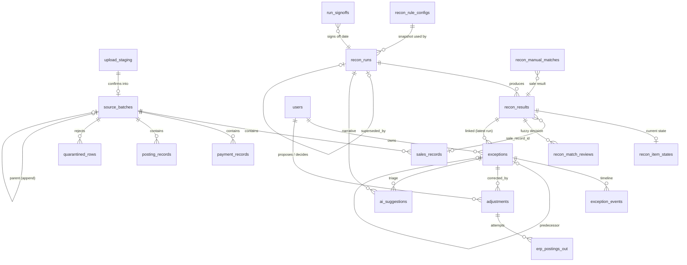

# Data model

The database is PostgreSQL 16. Money is `numeric(14,2)`. Money is never a floating-point number. Timestamps are `timestamptz`. Business dates are `date` values in Africa/Nairobi time.

## Main reconciliation tables

## Tables

| Table | Module | Contents |
|---|---|---|
| `users`, `sessions`, `password_reset_tokens` | Users | Accounts (Argon2id), sessions, the region for owner assignment, and an active flag |
| `permissions`, `roles`, `role_has_permissions`, `model_has_roles`, `model_has_permissions` | Rbac | The permission catalogue from the code. Roles are data made of permissions |
| `audit_events` | Audit | The append-only log with a hash chain (`prev_hash`, `hash`, the canonical data and the request ID). A trigger stops updates and deletes |
| `source_batches` | Ingestion | One version for each source, business date and load. It has a checksum, a mode (pull, upload_replace or upload_append), a manual flag, row counts, a data-quality summary and a status (active or superseded). A version never changes |
| `sales_records`, `payment_records`, `posting_records` | Ingestion | The rows of each batch that passed the checks |
| `quarantined_rows` | Ingestion | The rows that failed the checks, with the reasons (the data-quality report) |
| `upload_staging` | Ingestion | An upload that waits for confirm or cancel. It expires after 24 hours |
| `mock_source_rows`, `mock_erp_journals` | Ingestion | Simulated sales, payment and ERP systems |
| `recon_rule_configs` | Reconciliation | The matching settings, with versions |
| `recon_runs` | Reconciliation | One row for each run version: status, provisional or stale flags, a copy of the rule settings, the batch versions, summary figures and the replacement link |
| `recon_results` | Reconciliation | One row for each item: keys, amounts, variance, status, roll-up, rule, confidence, tag and section (current or prior_day) |
| `recon_item_states` | Reconciliation | The current state of an item across days (open, resolved or escalated) and its effective status |
| `recon_match_reviews` | Reconciliation | The confirm or reject decision of a person for a fuzzy match. The system remembers rejections at each new run |
| `recon_manual_matches` | Reconciliation | Late-payment matches that an analyst confirmed |
| `exceptions` | ExceptionManagement | Work items with a key (identity and status family) that stays the same across new runs. They have a category, severity, amount at risk, owner, due date, state and flags (soft, needs review) |
| `exception_events` | ExceptionManagement | Comments, state changes, relinks and escalations |
| `run_signoffs` | ExceptionManagement | The sign-off for each business date (it locks the date), carried exceptions and the reason to reopen |
| `adjustments` | Adjustments | A proposed correction: type, amount, reason, journal preview, maker, checker, state, idempotency key and ERP journal ID |
| `erp_postings_out` | Adjustments | Each posting attempt to the ERP, with the request, the response and the result |
| `ai_suggestions` | AI | Model, prompt version and hash, redacted input and its hash, output, time, tokens, fallback flag, and the decision of the person with the reason |
| `ai_settings`, `ai_eval_runs` | AI | The kill switch state and the evaluation results |
| `notifications` | Notifications | In-app notifications (the bell) |
| `setting_versions` | Shared | Settings with versions for the workflow, approval and AI sections |
| `jobs`, `job_batches`, `failed_jobs`, `cache`, `cache_locks` | Framework | Queue and cache |

## Constraints

- There is only one **active** batch for each source and business date (a partial unique index).
- `recon_runs (business_date, version)` is unique. A lock for each date lets only one run occur at a time.
- `exceptions.key` (identity and status family) has an index. At each new run, the system uses the existing exception for the key. Thus an item has one exception for each status family.
- `adjustments.idempotency_key`, `mock_erp_journals.idempotency_key` and `mock_erp_journals.journal_id` are unique. Thus a posting that occurs again is safe.
- `recon_manual_matches.payment_identity` is unique. A payment can have only one manual match. `recon_match_reviews (business_date, transaction_id, payment_identity)` is unique.
- `setting_versions (section, version)` is unique.
