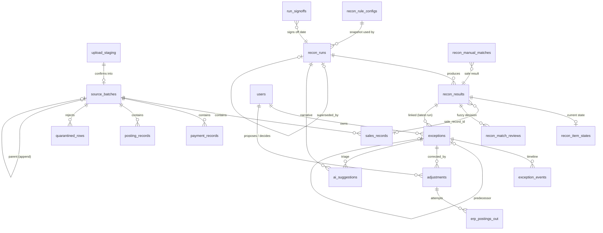

# Data model

PostgreSQL 16. Money is `numeric(14,2)` and is never a float. Timestamps are `timestamptz`. Business dates are `date` in Africa/Nairobi.

## Core reconciliation flow

## Tables

| Table | Module | Purpose |
|---|---|---|
| `users`, `sessions`, `password_reset_tokens` | Users | Accounts (Argon2id), sessions, region for owner assignment, active flag |
| `permissions`, `roles`, `role_has_permissions`, `model_has_roles`, `model_has_permissions` | Rbac | Permission catalogue synced from code; roles are data composed of permissions |
| `audit_events` | Audit | Append-only, hash-chained log (`prev_hash`, `hash`, canonical payload, request ID). A trigger blocks updates and deletes |
| `source_batches` | Ingestion | One immutable version per source, business date and ingestion: checksum, mode (pull / upload_replace / upload_append), manual flag, row counts, DQ summary, status (active / superseded) |
| `sales_records`, `payment_records`, `posting_records` | Ingestion | Validated rows of each batch |
| `quarantined_rows` | Ingestion | Rejected rows with reasons (DQ report) |
| `upload_staging` | Ingestion | Parsed upload awaiting confirm or cancel; expires after 24 h |
| `mock_source_rows`, `mock_erp_journals` | Ingestion | Stand-ins for the external sales, payments and ERP systems |
| `recon_rule_configs` | Reconciliation | Versioned matching settings |
| `recon_runs` | Reconciliation | One row per run version: status, provisional/stale, rule snapshot, exact batch versions, summary metrics, supersession |
| `recon_results` | Reconciliation | One row per reconciled item: keys, amounts, variance, status, roll-up, rule, confidence, tag, section (current / prior_day) |
| `recon_item_states` | Reconciliation | Current state of an item across days (open, resolved, escalated) and its effective status |
| `recon_match_reviews` | Reconciliation | Human confirm or reject of fuzzy matches (rejections are remembered on re-runs) |
| `recon_manual_matches` | Reconciliation | Analyst-confirmed late-payment matches |
| `exceptions` | ExceptionManagement | Work items keyed by identity + status family so they survive re-runs: category, severity, amount at risk, owner, due date, state, soft/needs-review flags |
| `exception_events` | ExceptionManagement | Comments, state transitions, relinks and escalations |
| `run_signoffs` | ExceptionManagement | Sign-off per business date (locks the date), carried exceptions, reopen reason |
| `adjustments` | Adjustments | Proposed correction: type, amount, reason, journal preview, maker, checker, state, idempotency key, ERP journal ID |
| `erp_postings_out` | Adjustments | Every posting attempt sent to the ERP, with request, response and success |
| `ai_suggestions` | AI | Model, prompt version and hash, redacted input and its hash, output, latency, tokens, fallback flag, human decision and reason |
| `ai_settings`, `ai_eval_runs` | AI | Kill switch state; evaluation results |
| `notifications` | Notifications | In-app notifications (bell) |
| `setting_versions` | shared | Versioned settings for workflow, approvals and AI sections |
| `jobs`, `job_batches`, `failed_jobs`, `cache`, `cache_locks` | framework | Queue and cache |

## Key constraints

- Exactly one **active** batch per source and business date (partial unique index).
- `recon_runs (business_date, version)` is unique; a per-date advisory lock serialises runs.
- `exceptions.key` (identity + status family) is indexed; the synchroniser reuses the existing exception for a key on every re-run, so an item keeps one exception per status family.
- `adjustments.idempotency_key`, `mock_erp_journals.idempotency_key` and `mock_erp_journals.journal_id` are unique, which gives replay-safe posting.
- `recon_manual_matches.payment_identity` is unique (a payment can be manually matched once), and `recon_match_reviews (business_date, transaction_id, payment_identity)` is unique.
- `setting_versions (section, version)` is unique.
