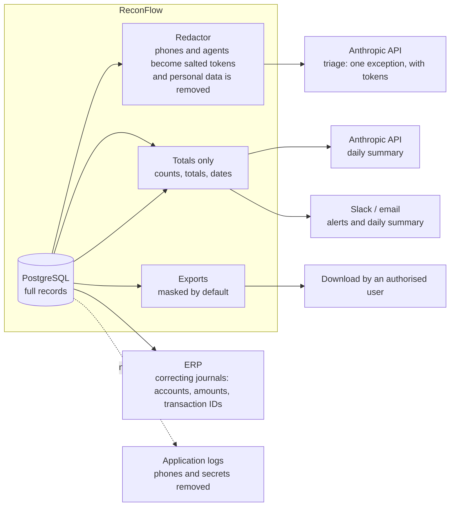

# Data protection

This document shows how ReconFlow protects personal data, as the Kenya Data Protection Act 2019 requires.

## 1. Data inventory and classification

The source of truth is `Modules/DataProtection/app/Support/FieldInventory.php`. The masking, logging and export code use this file.

| Dataset | Field | Classification |
|---|---|---|
| Sales | transaction_id, business_date, timestamp, region, payment_reference | Internal |
| Sales | agent_id, expected_amount | Confidential |
| Sales | **customer_phone** | **Personal** |
| Sales | product_sku, currency | Public |
| Payments | timestamp, channel, reference | Internal |
| Payments | payment_id, amount | Confidential |
| Payments | **payer_phone** | **Personal** |
| Payments | currency | Public |
| ERP postings | journal_id, posting_date, transaction_id, account, status | Internal |
| ERP postings | amount | Confidential |
| Users | **name, email** | **Personal** |
| Users | password (Argon2id hash) | Confidential |

All data in the demo is synthetic.

## 2. Data that goes out of the system

| Destination | Content | Personal data? |
|---|---|---|
| Anthropic (triage) | The amounts, times, statuses, rule, channel, region, SKU, references and ERP lines of one exception. Tokens such as `CUST_3f9a…` replace the customer, payer and agent | No direct identifiers. Pseudonym tokens only |
| Anthropic (summary) | Match rate, counts for each status, totals, open exceptions for each severity and category | No |
| Slack and email | Alert titles, counts, amounts, dates and links | No |
| ERP | Journal lines (accounts, amounts, transaction IDs, reference text) | No |
| Exports | Report rows. Phone numbers are masked, except when an authorised user gives a reason | Only in audited unmasked exports |
| Logs | Request data. A filter removes phone numbers, bearer tokens, JWTs and API keys from each log channel | No |

## 3. Masking rules

- Pages, API responses and default exports show phone numbers as `07•• ••• 123` (`PersonalData::maskPhone`).
- **Auditors**, and all users without `pii.unmask`, see only masked values.
- **Unmask** (Analyst, Finance Manager): "Show phone number" on the source record of an exception needs a purpose. The audit trail records `pii.unmasked` with the record and the fields.
- **Unmasked export** (Finance Manager, `results.export_unmasked`): needs a reason of 10 or more characters. The audit trail records `report.exported` with `masked=false`, the reason, the filters and the row count. The file name ends with `_UNMASKED`.
- The AI provider gets salted tokens (`PII_HASH_SALT`). The same customer always gets the same token. The token does not show the number.

## 4. Retention schedule

| Data | Retention | How |
|---|---|---|
| Transaction records (sales, payments, postings, quarantine, mock source copies) | 7 years (`RETENTION_TRANSACTIONS_YEARS`). Then the system anonymises the personal fields | `reconflow:anonymise-expired`, each day at 02:30. Audit event `retention.transactions_anonymised` |
| Upload staging | 24 hours | `PurgeStagedUploadsCommand` |
| AI suggestion logs and evaluation runs | 12 months (`RETENTION_AI_LOGS_MONTHS`) | `reconflow:ai-prune`, each day. Audit event `ai.logs_pruned` |
| Audit log | 7 years. Then an archive of gzipped JSONL files on a local volume, with a checkpoint | `audit:archive` (scheduled). You can still check the chain from the checkpoint |
| Notifications | While the user account exists | |
| Reconciliation results and exceptions | The same as transactions. They contain record IDs, not phone numbers | |

**Erasure requests.** The system always anonymises and never deletes. Thus the accounting records stay complete. An administrator sends `POST /privacy/erasures` (`privacy.erase`) with the phone number, a reason and the request reference. The system replaces each stored copy of the number with `ANONYMISED`. This includes the JSON copies in quarantine and in mock source rows. The system also clears staged uploads that contain the number. The audit entry keeps only a pseudonym token, the reference and the counts. Audit data never contains phone numbers, so the audit log does not change.

## 5. Short data protection impact assessment (DPIA)

| Item | Assessment |
|---|---|
| Processing | Daily reconciliation of sales, payments and ledger entries. Investigation of exceptions. Optional AI help |
| Lawful basis (the DPO must confirm) | Legitimate interest or legal obligation for financial records |
| Personal data | Phone numbers of customers and payers. Names and email addresses of staff |
| Necessity | Fuzzy matching (payments with no reference) needs phone numbers. Staff need them to speak to customers about differences. All other data is not personal |
| Minimisation | Masked by default. Tokens for the AI. Totals for notifications. The system keeps no customer names |
| Access | Roles made of permissions. The audit trail records each unmask and each unmasked export, with a purpose or a reason |
| Retention | Refer to section 4. Anonymisation, not deletion, keeps the ledger complete |
| Transfers | The AI provider can process data outside Kenya. **Go-live gate:** the DPO approves the provider terms and the transfer (refer to ai-governance.md §7) |
| Security | TLS (Caddy), Argon2id, CSP and security headers, secrets only in the environment, the audit hash chain, and the database on an internal network |
| Residual risk | Low to medium. To identify a person from a token, an attacker needs the salt. Only the secrets of the application contain the salt |
| Actions before production | DPO approval. Confirm the lawful basis. Approve the retention policy. Sign a data processing agreement with the provider. Do a penetration test |
