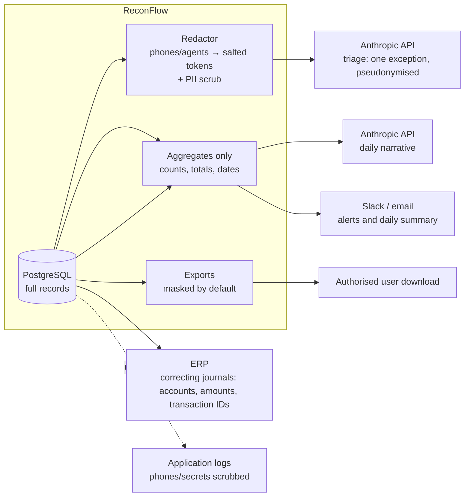

# Data protection

## 1. Data inventory and classification

The source of truth is `Modules/DataProtection/app/Support/FieldInventory.php`, which the masking, logging and export code use.

| Dataset | Field | Classification |
|---|---|---|
| Sales | transaction_id, business_date, timestamp, region, payment_reference | Internal |
| Sales | agent_id, expected_amount | Confidential |
| Sales | **customer_phone** | **Personal** |
| Sales | product_sku, currency | Public |
| Payments | timestamp, channel, reference | Internal |
| Payments | payment_id, amount | Confidential |
| Payments | **payer_phone** | **Personal** |
| Payments | currency | Public |
| ERP postings | journal_id, posting_date, transaction_id, account, status | Internal |
| ERP postings | amount | Confidential |
| Users | **name, email** | **Personal** |
| Users | password (Argon2id hash) | Confidential |

All data in the demo is synthetic.

## 2. What leaves the system

| Destination | Content | Personal data? |
|---|---|---|
| Anthropic (triage) | One exception's amounts, timestamps, statuses, rule, channel, region, SKU, references, ERP lines; customer/payer/agent as tokens like `CUST_3f9a…` | No direct identifiers; pseudonymous tokens only |
| Anthropic (narrative) | Match rate, counts by status, totals, open exceptions by severity and category | No |
| Slack / email | Alert titles, counts, amounts, dates, links | No |
| ERP | Journal lines (accounts, amounts, transaction IDs, reference text) | No |
| Exports | Report rows; phones masked unless an authorised user gives a reason | Only in audited unmasked exports |
| Logs | Request metadata; a processor scrubs phone numbers, bearer tokens, JWTs and API keys from every channel | No |

## 3. Masking rules

- Phones are shown as `07•• ••• 123` in every page, API response and default export (`PersonalData::maskPhone`).
- **Auditors** and anyone without `pii.unmask` see masked values only.
- **Unmask** (Analyst, Finance Manager): "Show phone number" on an exception's source record requires a purpose and writes `pii.unmasked` to the audit log with the record and fields.
- **Unmasked export** (Finance Manager, `results.export_unmasked`): requires a reason of at least 10 characters. It is audited as `report.exported` with `masked=false`, the reason, filters and row count, and the file name ends in `_UNMASKED`.
- The AI provider receives salted tokens (`PII_HASH_SALT`), so the same customer maps to the same token without revealing the number.

## 4. Retention schedule

| Data | Retention | Mechanism |
|---|---|---|
| Transaction records (sales, payments, postings, quarantine, mock source copies) | 7 years (`RETENTION_TRANSACTIONS_YEARS`), then personal fields anonymised | `reconflow:anonymise-expired`, daily 02:30; audit `retention.transactions_anonymised` |
| Upload staging | 24 hours | `PurgeStagedUploadsCommand` |
| AI suggestion logs and eval runs | 12 months (`RETENTION_AI_LOGS_MONTHS`) | `reconflow:ai-prune`, daily; audit `ai.logs_pruned` |
| Audit log | 7 years, then archived to gzipped JSONL on a local volume behind a checkpoint | `audit:archive` (scheduled); the chain stays verifiable from the checkpoint |
| Notifications | Kept with the user account | |
| Reconciliation results and exceptions | Same as transactions; they hold no phone numbers, only record IDs | |

**Erasure requests** always anonymise and never delete, so the accounting records stay complete: `POST /privacy/erasures` (`privacy.erase`, Administrator) with the phone number, a reason and the request reference. Every stored copy of that number is replaced with `ANONYMISED`, including JSON copies in quarantine and mock source rows. Matching staged uploads are cleared. The audit entry stores only a pseudonym token of the subject, the reference and the counts. Audit payloads never contain phone numbers, so the immutable audit log needs no rewriting.

## 5. DPIA-lite summary

| Item | Assessment |
|---|---|
| Processing | Daily reconciliation of sales, payments and ledger entries; exception investigation; optional AI assistance |
| Lawful basis (to confirm with DPO) | Legitimate interest / legal obligation for financial record keeping |
| Personal data | Customer and payer phone numbers; staff names and emails |
| Necessity | Phones are needed for fuzzy matching (no-reference payments) and for contacting customers about discrepancies. Everything else is non-personal |
| Minimisation | Masked by default; pseudonymised for AI; aggregates for notifications; no names of customers stored |
| Access | Permission-based roles; unmasking and unmasked exports audited with purpose or reason |
| Retention | Section 4; anonymisation rather than deletion keeps the ledger intact |
| Transfers | The AI provider may process data outside Kenya. **Go-live gate:** DPO approval of provider terms and cross-border transfer (see ai-governance.md §7) |
| Security | TLS (Caddy), Argon2id, CSP and security headers, secrets in env only, hash-chained audit, DB on an internal network |
| Residual risk | Low to medium: re-identification from pseudonymous tokens needs the salt, which is held only in the app's secrets |
| Actions before production | DPO sign-off; confirm the lawful basis; formal retention policy approval; provider DPA; penetration test |
