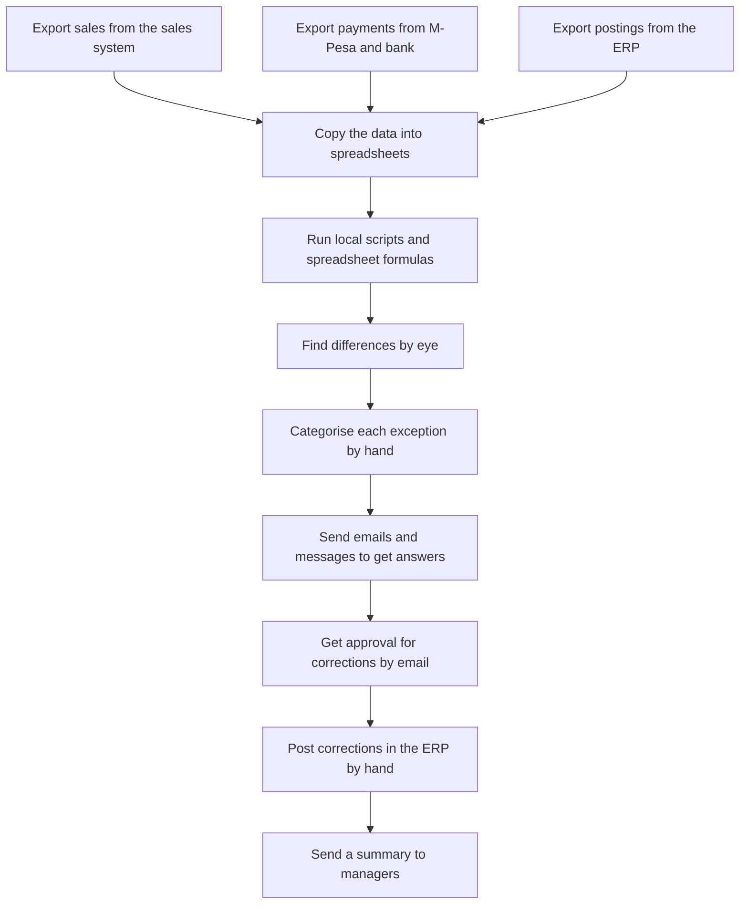
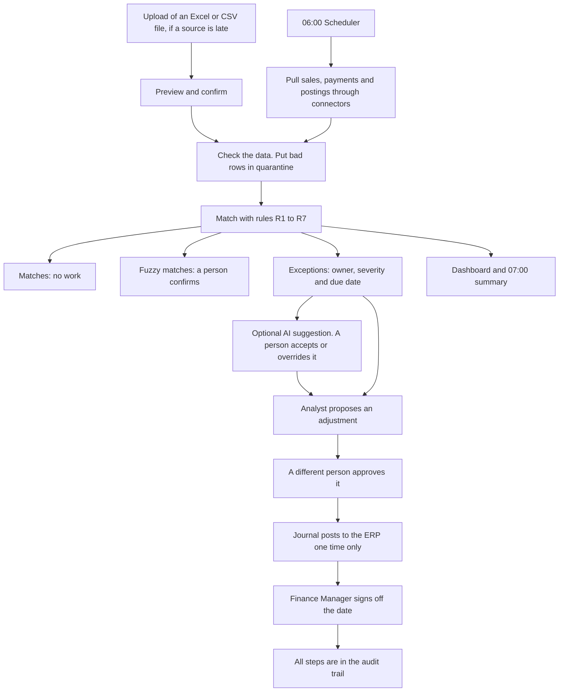

# Process map

This document compares the daily sales reconciliation today with the process in ReconFlow.

## Current process (manual)

The brief describes this process. It occurs one time each day, after the transaction data is available. It takes approximately 3 hours.

| Problem in the brief | Where it occurs |
|---|---|
| Excessive manual effort | Steps A to G: exports, copies, formulas and checks by eye |
| Process in many tools | Three systems, spreadsheets, scripts, email and chat |
| Late identification of exceptions | The work starts late and takes 3 hours |
| Limited visibility of status | The status is in files and messages, not in one place |
| Many manual interventions | Every exception and approval needs a person to chase it |
| Inconsistent audit trail | Emails and spreadsheet versions are the only record |
| Difficult to scale | The effort increases with each new transaction |

## Future process (ReconFlow)

## Step comparison

| Step | Today | ReconFlow | Who |
|---|---|---|---|
| Get the data | Manual exports from three systems | Automatic pull at 06:00, or an upload with a preview | System |
| Check the data | Not done in a consistent way | Checks on columns, types, currency, decimals, dates and duplicates. Bad rows go into quarantine with a reason | System |
| Match | Formulas and scripts on one computer | Seven rules in a fixed order. Each result shows the rule that decided it | System |
| Find exceptions | Checks by eye | Each problem becomes an exception with an owner, a severity and a due date | System |
| Investigate | Emails and messages | All records side by side on one page, with an optional AI suggestion | Analyst |
| Approve a correction | Email | Maker-checker in the system. More than $1,000 needs a Finance Manager | Analyst and manager |
| Post to the ERP | Manual entry | A balanced journal with an idempotency key | System |
| Report | A summary by email | A live dashboard, a report with exports, and a daily summary | System |
| Close the day | No formal step | Sign-off locks the date | Finance Manager |
| Audit | Emails and files | A hash-chained audit trail that an auditor can check | System |

## Effort

| Activity | Today (minutes) | ReconFlow (minutes) |
|---|---|---|
| Get, copy and check data | 60 | 0 |
| Match and find differences | 60 | 0 |
| Investigate and categorise | 40 | 15 |
| Approve and post corrections | 20 | 5 |
| **Total** | **180** | **20** |

These values are estimates. We will measure the real baseline during discovery and the parallel run.
